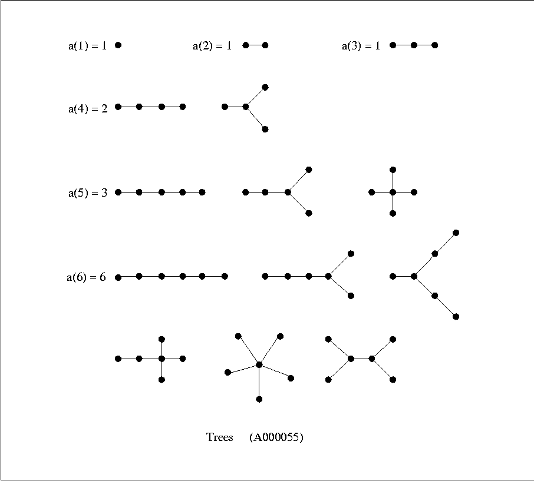

# Treegen

Generates all possible *unlabeled* trees quickly. All resulting trees are guaranteed to be non-isomorphic. 

For example, here are all unlabeled trees for *n* < 7:



All other trees with *n* < 7 are isomorphisms of the ones shown.

Generating all possible labeled trees and removing isomorphic copies would be computationally intractable (due to the combinatorial explosion of the *n^(n-2)* possible trees). Instead, this module uses an implementation of the Wright, Richmond, Odlyzko, and McKay (WROM) algorithm, which generates trees in O(1) time per tree.

## Installation

```bash
pip install treegen
```

## Usage

Generate trees in a level-order traversal (list of `int`s), or adjacency matrix (list of lists of `int`s):

```python
>>> import treegen

>>> treegen.generate_trees_level_order(n_vertices=5)
[[0, 1, 2, 1, 2], [0, 1, 2, 1, 1], [0, 1, 1, 1, 1]]

>>> treegen.generate_trees_adjacency_matrix(n_vertices=5)
[[[0, 1, 0, 1, 0],
  [1, 0, 1, 0, 0],
  [0, 1, 0, 0, 0],
  [1, 0, 0, 0, 1],
  [0, 0, 0, 1, 0]],
 [[0, 1, 0, 1, 1],
  [1, 0, 1, 0, 0],
  [0, 1, 0, 0, 0],
  [1, 0, 0, 0, 0],
  [1, 0, 0, 0, 0]],
 [[0, 1, 1, 1, 1],
  [1, 0, 0, 0, 0],
  [1, 0, 0, 0, 0],
  [1, 0, 0, 0, 0],
  [1, 0, 0, 0, 0]]]
```

This corresponds to the following diagram:


In addition, there are two other methods:

* `non_isomorphic_rooted_tree_count(n_vertices: int) -> int`: return the count of unlabeled trees for a given vertex number, quickly
* `level_order_to_adjacency_matrix(tree: List[int]) -> List[List[int]]`: conversion between level order traversals and adjacency matrices 
